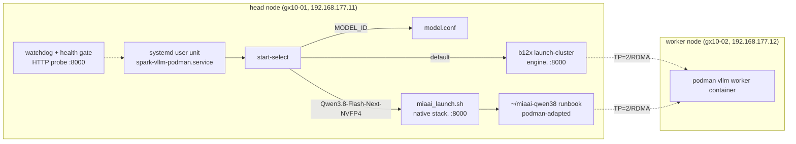

# DGX Spark Dual-Stack Deployment

Two-node NVIDIA DGX Spark cluster (ASUS Ascent GX10, GB10 Superchip, 128 GB
unified memory each) running **two alternative inference stacks** behind one
switch surface, plus the watchdog/supervision that keeps it serving.

| Stack | Model | Engine | Measured decode (t/s) |
|---|---|---|---|
| **b12x** | DeepSeek-V4-Flash-Vision-Exp | `eugr/spark-vllm-docker` launcher, kernel-level b12x/MLAS build (instanttensor, MTP/B12X attention, FP8) | baseline (production default) |
| **MiaAI-native** | nvidia/Qwen3.8-Flash-Next-NVFP4 | `MiaAI-Lab/Qwen3.8-Flash-Next-Dual-DGX-Sparks` stock-vLLM image + overlay patches | **45.5 mean / 68.3 peak** on this kit |

One `vllm-model-set <id> --apply` switches the whole cluster; the wrapper
dispatches each model to its own engine. Watchdog, health gate, selector,
page-cache eviction and `--status` are stack-agnostic and unchanged.

> This repo documents what was done on this cluster and ships the (scrubbed)
> tooling so the setup can be **reproduced from scratch** or borrowed by others.

## Architecture



Fabric: two ConnectX-7 200 GbE ports per node (four logical interfaces when
both are cabled). Both ports are used: 2 × 200 GbE, giving 400 Gb/s aggregate
mesh — see [docs/setup-fresh-install.md](docs/setup-fresh-install.md).

## Repo layout

```
scripts/            deployment + switching + supervision scripts (see below)
config/model.conf.template
config/flags/       per-model flags files (vLLM serve args) + per-model .env
systemd/            user units + the override.conf that wires start-select
docs/               fresh-install, architecture notes, benchmarking, troubleshooting
tools/              extra tooling (benchmark harness)
```

### Scripts (all installed to `~/.local/bin` by `scripts/deploy.sh`)

| Script | Purpose |
|---|---|
| `spark-vllm-podman-start-select` | systemd ExecStart. Reads `model.conf`, dispatches per model: flash-next → `miaai_launch.sh`; anything else → b12x `launch-cluster.sh` (unchanged path). Also forwards per-model `<flags>.env` vars into the container (`-e`). |
| `miaai_launch.sh` | Native flash-next stack: renders the MiaAI runbook `.env` from `model.conf` + per-model env + fabric constants, runs `start.sh --launch`, keeps the unit alive after readiness. |
| `vllm-model-set` | `vllm-model-set <hf-id> [alias] [--apply]` — the one switch surface. Writes `model.conf`, pauses watchdog, stops unit, **removes both container names (`vllm_node`, `vllm-fn`) on both nodes**, evicts the checkpoint page cache (OOM race), starts, waits for the readiness gate + smoke, restores watchdog. |
| `vllm-model-select.py` / `vllm-model-add.py` | model list / add + lock / delete / `--status` (orchestration state + live engine probe). |
| `spark-vllm-watchdog` | loop daemon: probe `/health` + `/v1/models` + completion on `:8000`, re-reading `SERVED_MODEL_NAME` every probe; restarts the unit on failure (backoff 1/5/25/125 min); maintenance flag file `.spark-vllm-maintenance`. |
| `spark-vllm-podman-health` | `ExecStartPost` readiness gate (25 min /health + worker ping). |
| `spark-vllm-podman-stop` | stops b12x cluster **and** removes `vllm-fn` on both nodes. |
| `spark-vllm-evict-cache.py` | release a checkpoint's page cache before load (GB10 unified-memory OOM race). |
| `podman-adapt-runbook.sh` | clones + podman-adapts the MiaAI runbook (`docker`→`podman`); run once on a fresh box. |

## Quickstart (cluster already up)

```bash
# one switch — DeepSeek:
vllm-model-set deepseek-ai/DeepSeek-V4-Flash-Vision-Exp --apply
# one switch — Qwen3.8-Flash-Next native stack:
vllm-model-set nvidia/Qwen3.8-Flash-Next-NVFP4 --apply
# status:
vllm-model-select --status
```

`--apply` does: watchdog pause → stop → remove both stacks' containers (both
nodes) → evict page cache → start (dispatcher picks the engine) → readiness
gate + smoke → watchdog restore. Typical Apply time: 7–13 min.

## Fresh install (from scratch)

Full walkthrough in [docs/setup-fresh-install.md](docs/setup-fresh-install.md):
DGX OS notes, ConnectX-7 cabling/IP layout, Docker→Podman (rootless), systemd
user units, both engines' images, weights download with HF token, page-cache
handling, and the dual-stack deploy (`scripts/deploy.sh`).

### Downloads / HF token

Weights are large (DeepSeek-V4-Flash-Vision-Exp ~176 files; flash-next ~124 GB
NVFP4). Do **not** commit tokens; obtain one at
<https://huggingface.co/settings/tokens> (read scope) and either:

```bash
huggingface-cli login          # stores the token outside the repo
export HF_TOKEN=hf_xxx         # or per-command:
hf download --token "$HF_TOKEN" --repo-type model <model-id> --local-dir ...
```

The repo's scripts never read a token from any file in this tree; they use the
standard `~/.cache/huggingface/token` / `HF_TOKEN` conventions.

## Per-model tuning knobs

`config/flags/<model>.conf` = `vllm serve` args (one per line). Optional
`:parallel `<flags>.env` = environment vars forwarded into the engine
container (e.g. flash-next's `VLLM_TRITON_FORCE_FIRST_CONFIG`). The
flash-next native stack's measured defaults (MTP 3 + expert parallel + FP8 KV
cache, `MM_ENCODER_TP_MODE=data`) live in `miaai_launch.sh` and can be
overridden in that `.env`.

## Results (llama-benchy, identical row: pp=1024, tg=800, depth 0/8192, runs=3)

| Config | Decode t/s | Depth-8192 t/s |
|---|---|---|
| b12x plain (pre-tuning) | 20.0 | 20.4 |
| b12x tuned (MTP/EP etc.) | 26.1 | 26.7 |
| **MiaAI native stack** | **45.5 (peak 68.3)** | **37.8 (peak 57.7)** |

Protocol and notes: [docs/benchmarking.md](docs/benchmarking.md).

## Troubleshooting

See [docs/troubleshooting.md](docs/troubleshooting.md) — FlashInfer autotune
stall (b12x engine, flaky on this kit), `shm_broadcast` warning semantics,
conmon teardown noise, page-cache OOM race, reasoning-model null-content probe
note.

## References (credit)

- **DeepSeek / b12x stack** (the standard DeepSeek deployment repo we used):
  - **`kambiz-aghaiepour/spark-vllm-docker`** — **our fork** of eugr's launcher,
    which we use for the cluster (<https://github.com/kambiz-aghaiepour/spark-vllm-docker>).
    Podman patches applied: commit `55cb129` — *"Add podman support via
    CONTAINER_RT environment variable"* (launcher runs under rootless podman;
    upstream uses docker). Applied vLLM PR patches (per fork README):
    **`local-inference-lab/vllm#669`** (full-PR-URL launch-time patches) and
    **`vllm-project/vllm#42354`** (NCCL load-order bug, `mods/use-official-vllm`).
  - **Upstream (credit): `eugr/spark-vllm-docker`** — the repo this was forked
    from (<https://github.com/eugr/spark-vllm-docker>). For a vanilla (docker)
    deployment, use upstream directly.
  - `christopherowen/spark-vllm-mxfp4-docker` — Dockerfile lineage; vLLM /
    FlashInfer / CUTLASS forks. Our image pins `christopherowen/vllm@045293d`
    (<https://github.com/christopherowen/spark-vllm-mxfp4-docker>)
  - b12x engine fork by Luke Alonso (`local-inference-lab/vllm`,
    `--exp-b12x` per eugr README), plus `nvcr.io/nvidia/pytorch` NGC base image
- **Qwen3.8-Flash-Next stack**:
  - `MiaAI-Lab/Qwen3.8-Flash-Next-Dual-DGX-Sparks` — runbook, image
    `vllm/vllm-openai:qwen38-flash-next`, overlay patches, 47k draft vocab
    (<https://github.com/MiaAI-Lab/Qwen3.8-Flash-Next-Dual-DGX-Sparks>)
- **Hardware / cluster docs**: NVIDIA DGX Spark clustering
  (<https://docs.nvidia.com/dgx/dgx-spark/spark-clustering.html>) and
  Connect-Two-Sparks (<https://build.nvidia.com/spark/connect-two-sparks/stacked-sparks>)

## License / attribution

AGPL-3.0. The MiaAI-side launcher adaptation and the runbook invocation derive
from the AGPL-3.0 `MiaAI-Lab/Qwen3.8-Flash-Next-Dual-DGX-Sparks` repo (kept as
a separate clone at runtime, not vendored). See `NOTICE.md`. Internal use only
unless upstream terms are satisfied.

## Security

- Nothing in this tree contains credentials (verified by scrub; tokens stay in
  `~/.cache/huggingface` / env vars).
- The systemd session unit and rootless podman run as a normal user; no
  privilege escalation beyond what `podman`/`systemd --user` grant.
- `start.sh` renders transient launch scripts with mode 0600 (API keys never
  left on disk in the runbook's /tmp).
